- **远程过程调用**
- 实验报告
- 宋灵冰
- 24320162202900

# 1. 目录
<!-- TOC -->

- [1. 目录](#1-目录)
- [2. 引言](#2-引言)
- [3. 环境](#3-环境)
  - [3.1. 编程环境](#31-编程环境)
  - [3.2. 测试环境](#32-测试环境)
- [4. 实现过程](#4-实现过程)
  - [4.1. RMI普通实现](#41-rmi普通实现)
    - [4.1.1. 编码](#411-编码)
    - [4.1.2. 打包](#412-打包)
    - [4.1.3. 部署](#413-部署)
    - [4.1.4. 测试](#414-测试)
  - [4.2. Dubbo结合RMI协议实现](#42-dubbo结合rmi协议实现)
    - [4.2.1. 编码](#421-编码)
    - [4.2.2. 打包](#422-打包)
    - [4.2.3. 部署](#423-部署)
    - [4.2.4. 测试](#424-测试)
- [5. 总结](#5-总结)
  - [5.1. 遇到的问题](#51-遇到的问题)
  - [5.2. 一些概念](#52-一些概念)
    - [5.2.1. Java RMI](#521-java-rmi)
    - [5.2.2. Dubbo](#522-dubbo)
  - [5.3. 小结](#53-小结)

<!-- /TOC -->

# 2. 引言
Java RMI可以被看作是 RPC 的 Java 版本。但是传统 RPC 并不能很好地应用于分布式对象系统，而 Java RMI 则支持存储于不同地址空间的程序级对象之间彼此进行通信，实现远程对象之间的无缝远程调用。<br>
本次实验主要是使用 RMI 协议对服务端图结构进行操作，实现对图节点的增删、边的增删以及顶点间最短路径的搜索查找功能。<br>
同时，通过对基础RMI程序以及基于Dubbo框架的RMI程序的编写，熟悉使用 Java RMI，掌握RPC的原理。<br>

> 本次实验的目的在于:<br>
> 掌握远程过程调用原理，基于 Java RMI 进行远程编程和控制。<br>
> 要求定义远程接口类及实现类、以及相应的处理方法；客户端利用RMI实现远程调用服务。<br>
> 同时，在两台机器之间验证结果正确。

# 3. 环境
## 3.1. 编程环境
   - OS: Windows10系统
   - IDE: IDEA 2018.3
   - JAVA: JDK1.8.0_162
## 3.2. 测试环境
   - 环境1
     - 客户端：Windows10
     - 服务端：Windows10
   - 环境2
     - 客户端：Windows10
     - 服务端：CentOS7

# 4. 实现过程
## 4.1. RMI普通实现
### 4.1.1. 编码
- **项目总体结构**

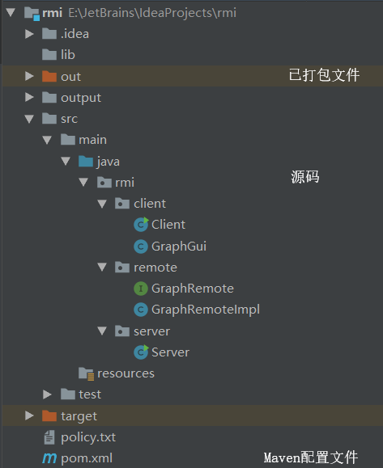

- **引入依赖**

<details>
<summary>查看</summary>

```
// pom.xml
...
    <dependencies>
        <dependency>
            <groupId>org.jgrapht</groupId>
            <artifactId>jgrapht-core</artifactId>
            <version>1.3.0</version>
        </dependency>
        <dependency>
            <groupId>org.jgrapht</groupId>
            <artifactId>jgrapht-ext</artifactId>
            <version>1.2.0</version>
        </dependency>
        <dependency>
            <groupId>jgraph</groupId>
            <artifactId>jgraph</artifactId>
            <version>5.13.0.0</version>
        </dependency>
    </dependencies>
...
```
</details>

此处引入jgrapht用于操作图结构，使用jgraph用于绘制图形。<br>

- **服务接口编写**

<details>
<summary>查看</summary>

```
// GraphRemote.java
package rmi.remote;

import org.jgrapht.ListenableGraph;
import org.jgrapht.graph.DefaultEdge;

/**
 * @author SongLingbing
 * @date 2019/2/28 12:26
 */
public interface GraphRemote extends java.rmi.Remote {
    /**
     * 获取图对象，用于绘制
     *
     * @return 图对象
     * @author SongLingbing
     * @date 2019/2/28 12:27
     */
    ListenableGraph<String, DefaultEdge> getGraph() throws java.rmi.RemoteException;

    /**
     * 插入新的点
     *
     * @param vertex 点名称
     * @return 插入结果(true / false)
     * @author SongLingbing
     * @date 2019/2/28 12:29
     */
    Boolean insertVertex(String vertex) throws java.rmi.RemoteException;

    /**
     * 插入新的边
     *
     * @param source 起始点
     * @param target 目标点
     * @return 插入结果(true / false)
     * @author SongLingbing
     * @date 2019/2/28 12:30
     */
    Boolean insertEdge(String source, String target) throws java.rmi.RemoteException;

    /**
     * 删除指定点
     *
     * @param vertex 点名称
     * @return 删除结果(true / false)
     * @author SongLingbing
     * @date 2019/2/28 12:31
     */
    Boolean deleteVertex(String vertex) throws java.rmi.RemoteException;

    /**
     * 获取顶点数量
     *
     * @return 顶点数量
     * @author SongLingbing
     * @date 2019/2/28 12:32
     */
    Integer getNumOfVertex() throws java.rmi.RemoteException;

    /**
     * 获取边数量
     *
     * @return 边数量
     * @author SongLingbing
     * @date 2019/2/28 12:33
     */
    Integer getNumOfEdge() throws java.rmi.RemoteException;

    /**
     * 获取两个顶点之间的最短路径
     *
     * @param source 起始点
     * @param target 目标点
     * @return 最短路径
     * @author SongLingbing
     * @date 2019/2/28 12:35
     */
    String getShortestPath(String source, String target) throws java.rmi.RemoteException;
}
```
</details>

接口文件定义了图的基本操作，包括：获取图对象，插入新的边、顶点，获取边的数量、顶点的数量、两点之间最短路径，删除顶点、边。<br>

- **服务端编写**

<details>
<summary>查看</summary>

```
// Server.java
package rmi.server;

import rmi.remote.GraphRemote;
import rmi.remote.GraphRemoteImpl;

import java.rmi.RMISecurityManager;
import java.rmi.registry.LocateRegistry;
import java.rmi.registry.Registry;
import java.rmi.server.UnicastRemoteObject;

/**
 * @author SongLingbing
 * @date 2019/2/28 12:26
 */
public class Server {
    public Server() {
    }

    public static void main(String[] args) {
        System.setSecurityManager(new RMISecurityManager());
        final Integer PORT = 3333;
        // 创建服务对象的实例
        final GraphRemoteImpl obj = new GraphRemoteImpl();
        try {
            // 将服务对象注册到注册表
            GraphRemote stub = (GraphRemote) UnicastRemoteObject.exportObject(obj, 0);
            Registry registry = LocateRegistry.createRegistry(PORT);
            registry.rebind("GraphRemote", stub);

            System.err.println("Server ready....");
            System.err.println("Listening on port " + PORT.toString() + " ....");
        } catch (Exception e) {
            e.printStackTrace();
        }
    }
}
```
</details>

服务端将对象注册到注册表，并绑定对应的接口。<br>

- **客户端编写**

<details>
<summary>查看</summary>

```
// Client.java
package rmi.client;

import rmi.remote.GraphRemote;

import javax.swing.*;
import java.awt.*;
import java.awt.event.ActionEvent;
import java.awt.event.ActionListener;
import java.net.MalformedURLException;
import java.rmi.Naming;
import java.rmi.NotBoundException;
import java.rmi.RemoteException;

/**
 * @author SongLingbing
 * @date 2019/2/28 12:26
 */
public class Client {
    private Client() {
    }

    public static void main(String[] args) throws RemoteException, MalformedURLException, NotBoundException {
        // 定义图形界面大小
        final Dimension DEFAULT_FRAME_SIZE = new Dimension(640, 480);
        //  连接并获取图服务对象
        String host = (args.length < 1) ? "localhost" : args[0];
        String url = "rmi://" + host + ":3333/GraphRemote";
        GraphRemote stub = (GraphRemote) Naming.lookup(url);
        System.out.println("link to the server: \n" + url);

        // 创建GUI总面板
        JFrame frame = new JFrame();
        frame.setLayout(new BorderLayout());

        // 获取图对象的GUI
        GraphGui graphGui = GraphGui.getInstance();

        // 获取功能区面板
        JPanel jPanel = getPanel(stub, graphGui, frame);

        // 获取图的初始状态
        graphGui.refresh(stub.getGraph(), frame, jPanel);

        // 设置面板相关信息
        frame.setPreferredSize(DEFAULT_FRAME_SIZE);
        frame.setResizable(false);
        frame.setTitle("JGraphT Rmi");
        frame.setDefaultCloseOperation(JFrame.EXIT_ON_CLOSE);
        frame.pack();
        frame.setVisible(true);
    }
    ...
}
```
</details>

客户端的主函数通过RMI调用远程对象，同时使用Swing绘制图形界面，实时显示对象状态，并可以对对象进行操作。<br>

<details>
<summary>查看</summary>

```
// Client.java
    /**
      * 获取功能区面板，包含输入、显示图情况等功能
      *
      * @param stub 图服务对象
      * @param graphGui 图对象的GUI界面
      * @param frame GUI总面板
      * @return 功能区面板
      * @author SongLingbing
      * @date 2019/3/4 16:40
      */
    public static JPanel getPanel(final GraphRemote stub, final GraphGui graphGui,
                                  final JFrame frame) throws RemoteException {
        ...
        // 图对象信息（顶点与边数量）
        JLabel graphInfo = new JLabel("Graph Info: ");
        jPanel.add(graphInfo);
        JLabel vertexNum = new JLabel("number of vertex: " + stub.getNumOfVertex().toString());
        jPanel.add(vertexNum);
        JLabel edgeNum = new JLabel("number of edge: " + stub.getNumOfEdge().toString());
        jPanel.add(edgeNum);
        ...
    }
```
</details>

该方法定义了一个工具栏面板，将远程对象的方法与工具栏按钮进行绑定，实现图形化界面的操作。<br>
>注：图形对象显示相关的方法定义在`/client/GraphGui.java`文件中

### 4.1.2. 打包
在idea中使用`Ctrl+Alt+Shift+S`打开`Project Structure`界面，选择`Artifacts`。按照如下方式添加新配置。[详见此处](https://www.cnblogs.com/blog5277/p/5920560.html)<br>

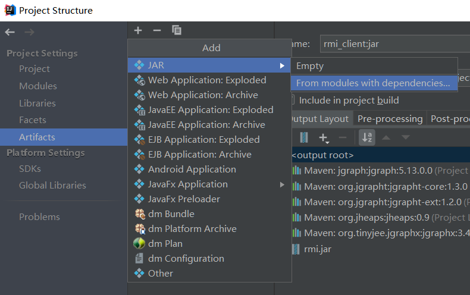
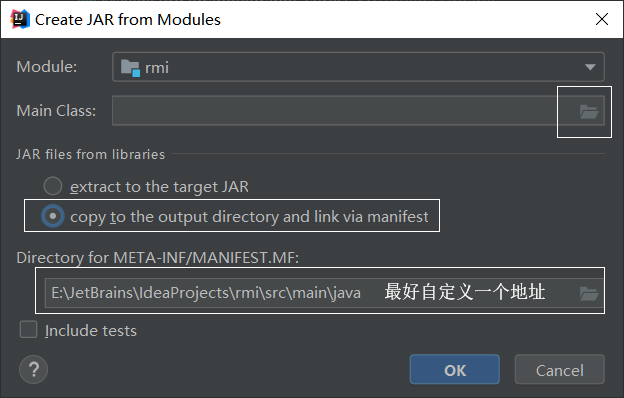
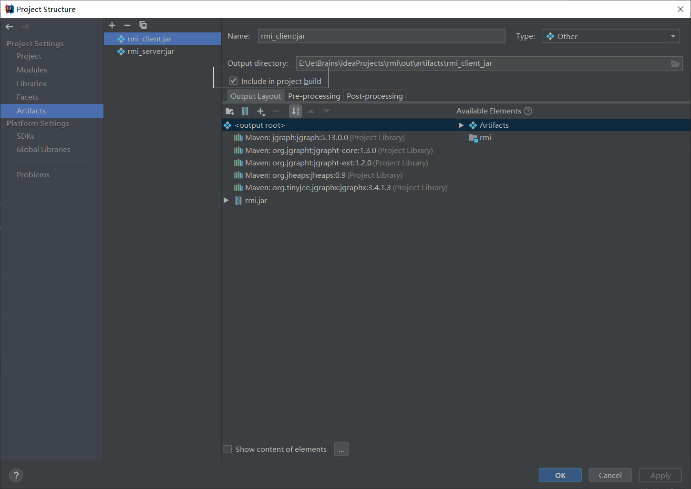

>注意配置两个打包项目，将客户端和服务端分别打包。<br>
>注意应将客户端和服务端的输出路径分开，避免混淆。<br>

选择`Build->Build Artifacts...`<br>

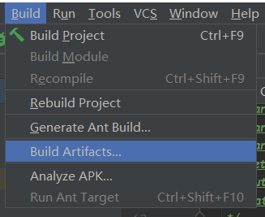

将弹出如下界面，选择对应的模块打包即可。<br>

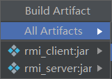

在输出目录下即可查看打包结果。<br>
>（其中`.bat`文件为手动编写的快速启动文件）<br>

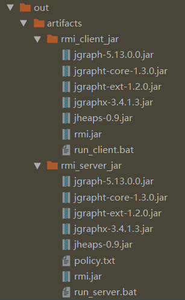

### 4.1.3. 部署
- **服务端部署在Windows10**

由于已经打包成jar包，故无需额外操作。<br>
直接双击执行`run_server.bat`或在打包文件夹下执行`java -Djava.security.policy=policy.txt -jar rmi.jar`即可启动服务端程序。<br>

- **服务端部署在CentOS7**

>此处服务器环境使用阿里云服务器<br>

使用WinSCP（或其他文件传输工具），将服务端打包文件夹发送到服务器上。<br>

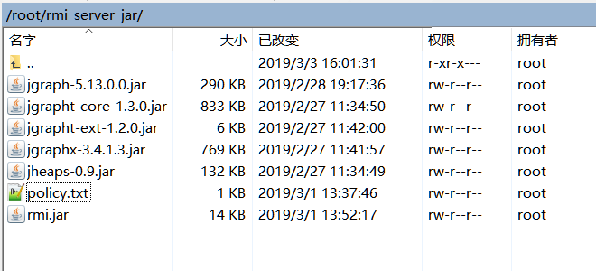

在服务器终端上使用`nohup java -Djava.security.policy=policy.txt -jar rmi.jar & >log.out`启动服务端程序，并将其调至后台运行。<br>

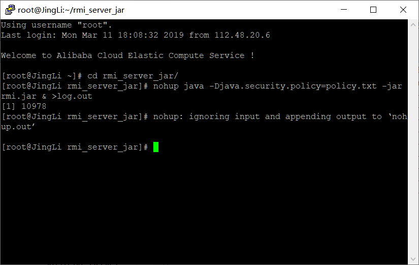

### 4.1.4. 测试
- **服务端部署在Windows10**

在打包文件夹下执行`java -jar rmi.jar`即可启动客户端。<br>

- **服务端部署在CentOS7**

直接双击执行`run_client.bat`或在打包文件夹下执行`java -jar rmi.jar 服务器地址`即可启动客户端。<br>
>两个环境下操作及效果相同，此处仅放置一个动图作为效果图

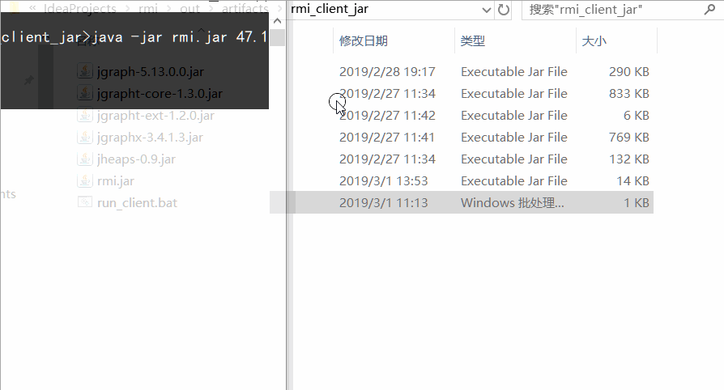

## 4.2. Dubbo结合RMI协议实现
### 4.2.1. 编码
- **项目总体结构**

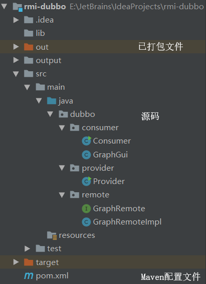

- **引入依赖**

<details>
<summary>查看</summary>

```
// pom.xml
...
    <dependencies>
        <dependency>
            <groupId>org.jgrapht</groupId>
            <artifactId>jgrapht-core</artifactId>
            <version>1.3.0</version>
        </dependency>
        <dependency>
            <groupId>org.jgrapht</groupId>
            <artifactId>jgrapht-ext</artifactId>
            <version>1.2.0</version>
        </dependency>
        <dependency>
            <groupId>jgraph</groupId>
            <artifactId>jgraph</artifactId>
            <version>5.13.0.0</version>
        </dependency>
        <dependency>
            <groupId>com.alibaba</groupId>
            <artifactId>dubbo</artifactId>
            <version>2.6.1</version>
            <exclusions>
                <exclusion>
                    <groupId>log4j</groupId>
                    <artifactId>log4j</artifactId>
                </exclusion>
            </exclusions>
        </dependency>
        <dependency>
            <groupId>org.javassist</groupId>
            <artifactId>javassist</artifactId>
            <version>3.20.0-GA</version>
        </dependency>
        <dependency>
            <groupId>io.netty</groupId>
            <artifactId>netty</artifactId>
            <version>3.6.10.Final</version>
        </dependency>
        <dependency>
            <groupId>org.apache.curator</groupId>
            <artifactId>curator-framework</artifactId>
            <version>2.9.1</version>
        </dependency>
        <dependency>
            <groupId>org.slf4j</groupId>
            <artifactId>slf4j-api</artifactId>
            <version>1.7.22</version>
        </dependency>
        <dependency>
            <groupId>ch.qos.logback</groupId>
            <artifactId>logback-classic</artifactId>
            <version>1.1.3</version>
        </dependency>
        <!-- https://mvnrepository.com/artifact/org.slf4j/slf4j-log4j12 -->
        <dependency>
            <groupId>org.slf4j</groupId>
            <artifactId>slf4j-log4j12</artifactId>
            <version>1.7.22</version>
        </dependency>
    </dependencies>
...
```
</details>

此处除了引入jgrapht和jgraph，还引入了dubbo、netty、curator以及一些必要的依赖包。<br>

- **服务接口编写**

同4.1.1(略)

- **服务端编写**

<details>
<summary>查看</summary>

```
// Provider.java
package dubbo.provider;

import com.alibaba.dubbo.common.utils.LogUtil;
import com.alibaba.dubbo.config.ApplicationConfig;
import com.alibaba.dubbo.config.ProtocolConfig;
import com.alibaba.dubbo.config.RegistryConfig;
import com.alibaba.dubbo.config.ServiceConfig;
import dubbo.remote.GraphRemote;
import dubbo.remote.GraphRemoteImpl;

import java.util.ArrayList;
import java.util.concurrent.atomic.AtomicBoolean;

/**
 * @author SongLingbing
 * @date 2019/2/28 12:26
 */
public class Provider {
    private static AtomicBoolean running = new AtomicBoolean(false);

    public Provider() {
    }

    public static void main(String[] args) {
        String host = (args.length < 1) ? "localhost" : args[0];
        while (true) {
            if (!running.get()) {
                final GraphRemote obj = new GraphRemoteImpl();
                // 当前应用配置
                ApplicationConfig application = new ApplicationConfig();
                application.setName("dubbo-provider");

                // 连接注册中心配置
                RegistryConfig registry = new RegistryConfig();
                registry.setProtocol("zookeeper");
                registry.setAddress(host + ":2181");

                // 服务提供者协议配置，指定为rmi协议
                ProtocolConfig protocol = new ProtocolConfig();
                protocol.setName("rmi");
                protocol.setPort(6666);

                // 服务提供者暴露服务配置
                ServiceConfig<GraphRemote> service = new ServiceConfig<>();
                service.setApplication(application);
                service.setRegistry(registry);
                service.setProtocol(protocol);
                service.setInterface(GraphRemote.class);
                service.setRef(obj);
                service.setVersion("1.0.0");
                // 暴露及注册服务
                service.export();
                running.set(true);
            }
            LogUtil.printList(new ArrayList<>());
        }
    }
}
```
</details>

配置dubbo框架provider使用rmi协议，并且注册对应的服务对象。<br>

- **客户端编写**
<details>
<summary>查看</summary>

```
// Consumer.java
package dubbo.consumer;

import com.alibaba.dubbo.config.ApplicationConfig;
import com.alibaba.dubbo.config.ReferenceConfig;
import com.alibaba.dubbo.config.RegistryConfig;
import dubbo.remote.GraphRemote;

import javax.swing.*;
import java.awt.*;
import java.awt.event.ActionEvent;
import java.awt.event.ActionListener;
import java.awt.event.WindowAdapter;
import java.awt.event.WindowEvent;

/**
 * @author SongLingbing
 * @date 2019/2/28 12:26
 */
public class Consumer {
    private Consumer() {
    }

    public static void main(String[] args) {
        final Dimension DEFAULT_FRAME_SIZE = new Dimension(640, 480);
        String host = (args.length < 1) ? "localhost" : args[0];
        // 当前应用配置
        ApplicationConfig application = new ApplicationConfig();
        application.setName("dubbo-consumer");
        // 连接注册中心配置
        RegistryConfig registry = new RegistryConfig();
        registry.setProtocol("zookeeper");
        registry.setAddress(host + ":2181");

        // 引用远程服务
        ReferenceConfig<GraphRemote> reference = new ReferenceConfig<>();
        reference.setApplication(application);
        reference.setRegistry(registry);
        reference.setInterface(GraphRemote.class);
        reference.setVersion("1.0.0");
        GraphRemote stub = reference.get();

        JFrame frame = new JFrame();
        frame.setLayout(new BorderLayout());

        GraphGui graphGui = GraphGui.getInstance();

        JPanel jPanel = getPanel(stub, graphGui, frame);

        graphGui.refresh(stub.getGraph(), frame, jPanel);

        frame.setPreferredSize(DEFAULT_FRAME_SIZE);
        frame.setResizable(false);
        frame.setTitle("JGraphT dubbo");
        frame.addWindowListener(new WindowAdapter() {
            @Override
            public void windowClosing(WindowEvent e) {
                super.windowClosing(e);
                reference.destroy();
            }
        });
        frame.setDefaultCloseOperation(JFrame.EXIT_ON_CLOSE);
        frame.pack();
        frame.setVisible(true);
    }
...
```
</details>

连接注册中心，获取远程对象并将其使用swing绘制到界面。<br>

### 4.2.2. 打包

同4.1.2(略)

### 4.2.3. 部署
- **安装并启动zookeeper**

推荐使用[zookeeper3.4.12](http://archive.apache.org/dist/zookeeper/stable/zookeeper-3.4.12.tar.gz)，[查看安装教程](http://dubbo.apache.org/zh-cn/docs/admin/install/zookeeper.html)。<br>

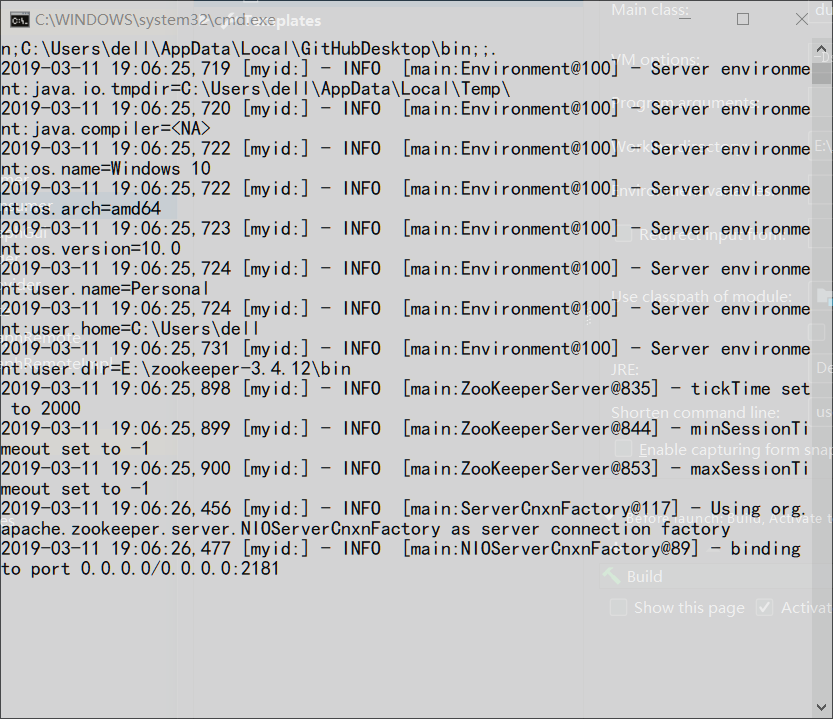

- **服务端部署在Windows10**

由于已经打包成jar包，故无需额外操作。<br>
直接双击执行`run_provider.bat`或在打包文件夹下执行`java -Dsun.rmi.transport.tcp.responseTimeout=3000 -jar rmi-dubbo.jar`即可启动服务端程序。<br>

- **服务端部署在CentOS7**

>此处服务器环境使用阿里云服务器<br>

使用WinSCP（或其他文件传输工具），将服务端打包文件夹发送到服务器上。<br>

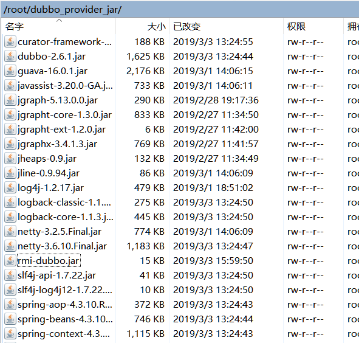

在服务器终端上使用`nohup java -Dsun.rmi.transport.tcp.responseTimeout=3000 -jar rmi-dubbo.jar & >log.out`启动服务端程序，并将其调至后台运行。<br>

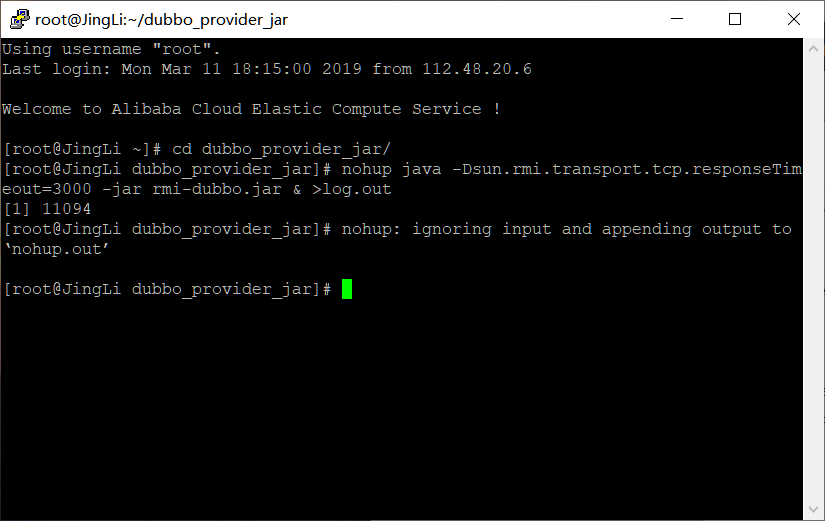

### 4.2.4. 测试
- **服务端部署在Windows10**

在打包文件夹下执行`java -jar rmi-dubbo.jar`即可启动客户端。<br>

- **服务端部署在CentOS7**

直接双击执行`run_consumer.bat`或在打包文件夹下执行`java -jar rmi-dubbo.jar 服务器地址`即可启动客户端。<br>
>两个环境下操作过程相同，此处仅放置一个动图作为效果图


# 5. 总结
## 5.1. 遇到的问题
- **在使用dubbo框架测试时，分别部署在CentOS7和Windows10时，连接和响应的速度慢**

起初认为是dubbo框架没有配置好，经过测试发现响应慢的原因是服务器配置较低，无法保障zookeeper的运行效率，出现长时间响应问题。

## 5.2. 一些概念
### 5.2.1. Java RMI

Java RMI （Remote Method Invocation）- 远程方法调用，能够让客户端像使用本地调用一样调用服务端 Java 虚拟机中的对象方法。RMI 是面向对象语言领域对 RPC （Remote Procedure Call）的完善，用户无需依靠 IDL 的帮助来完成分布式调用，而是通过依赖接口这种更简单自然的方式。<br>

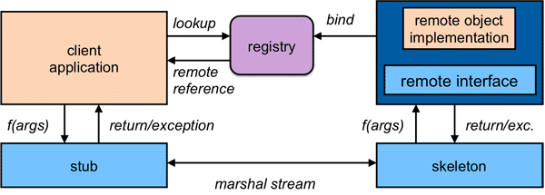

### 5.2.2. Dubbo

现代的分布式服务框架的基本概念与 RMI 是类似的，同样是使用 Java 的 Interface 作为服务契约，通过注册中心来完成服务的注册和发现，远程通讯的细节也是通过代理类来屏蔽。具体来说，Dubbo 在工作时有以下四个角色参与：<br>
1. 服务提供者 - 启动时在指定端口上暴露服务，并将服务地址和端口注册到注册中心上<br>
2. 服务消费者 - 启动时向注册中心订阅自己感兴趣的服务，以便获得服务提供方的地址列表<br>
3. 注册中心 - 负责服务的注册和发现，负责保存服务提供方上报的地址信息，并向服务消费方推送<br>
4. 监控中心 - 负责收集服务提供方和消费方的运行状态，比如服务调用次数、延迟等，用于监控<br>
5. 运行容器 - 负责服务提供方的初始化、加载以及运行的生命周期管理<br>

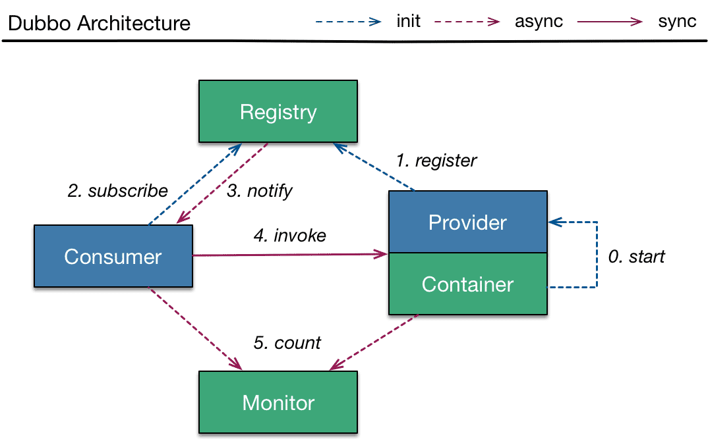

>[参考地址](http://dubbo.apache.org/zh-cn/blog/dubbo-101.html)

## 5.3. 小结
本次实验实现了RMI应用的服务注册与服务发现功能。<br>
同时，利用Dubbo框架对RMI协议的支持实现了基于Dubbo框架的RMI应用。<br>
在此过程中，了解到RPC在Java中的应用以及分布式框架Dubbo的配置与基本使用。